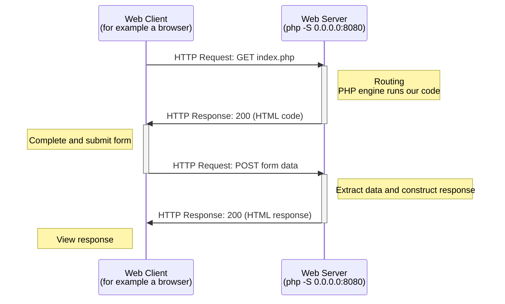

# PHP Codespace für CLinDat 31 (mibeg Institute)

Eine PHP-Spielwiese zum Programmieren und Ausprobieren

## HTTP Request/Response

```mermaid
sequenceDiagram
  participant C as Web Client<br />(for example a browser)
  participant S as Web Server<br />(php -S 0.0.0.0:8080)
  C->>S: HTTP Request: GET index.php
  activate S
  Note right of S: Routing<br />PHP engine runs our code
  S->>C: HTTP Response: 200 (HTML code)
  deactivate S
  activate C
  Note left of C: Complete and submit form
  C->>S: HTTP Request: POST form data
  deactivate C
  activate S
  Note right of S: Extract data and construct response
  S->>C: HTTP Response: 200 (HTML response)
  deactivate S
  Note left of C: View response
```
